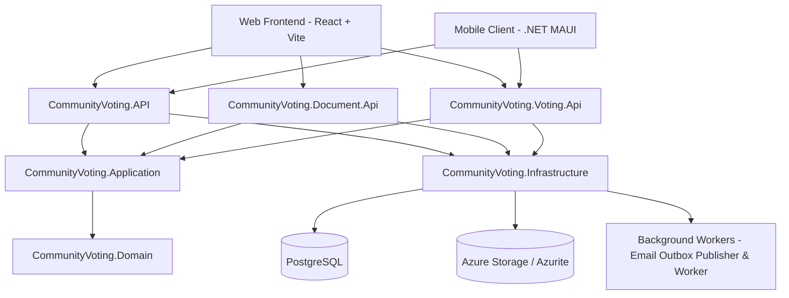

# Community Voting Platform (CommunityVoting)

**CommunityVoting** is a comprehensive solution built with **.NET 9**, **React**, and **.NET MAUI** designed for managing homeowners' associations, meeting convocations, real-time in-person/remote voting, and secure document storage.

---

## 🏛️ System Architecture

The solution follows the principles of **Clean Architecture**, **Domain-Driven Design (DDD)**, and a decoupled service-oriented architecture with support for **.NET Aspire**.



---

## 📦 Projects & Components Structure

### 1. Domain & Application Core

* **[CommunityVoting.Domain](src/CommunityVoting.Domain)**: Contains domain entities (`User`, `Community`, `CommunityMember`, `Meeting`, `AgendaItem`, `Proposal`, `Document`, `MeetingVoterAccess`, `EmailOutboxMessage`), enums, business rules, and invariants.
* **[CommunityVoting.Application](src/CommunityVoting.Application)**: Defines core business logic, DTOs, interface abstractions (`IAuthService`, `ICommunityService`, `IMeetingService`, `IAgendaItemService`, `IProposalService`, `IDocumentService`, `IInvitationService`, `IMeetingAccessService`), and modular Dependency Injection registration.

### 2. Infrastructure & Persistence

* **[CommunityVoting.Infrastructure](src/CommunityVoting.Infrastructure)**:
  * **Persistence**: EF Core with `CommunityVotingDbContext`, entity mappings, and high-performance database indexes for PostgreSQL.
  * **Storage**: Implementation of the file storage service backed by Azure Blob Storage / Azurite.
  * **Outbox Pattern**: `EmailOutboxPublisher` and `EmailWorkerService` as hosted services (`IHostedService`) for reliable, asynchronous processing of email notifications.

### 3. API Services (.NET 9 Minimal APIs)

* **[CommunityVoting.API](src/CommunityVoting.API)**: Main API handling user management, JWT authentication, community administration, meeting convocations, agenda items, proposals, and voting access credentials.
* **[CommunityVoting.Document.Api](src/CommunityVoting.Document.Api)**: Microservice dedicated exclusively to file upload, download, streaming, and document linking for proposals and communities.
* **[CommunityVoting.Voting.Api](src/CommunityVoting.Voting.Api)**: Real-time service powered by SignalR for live vote submission, instant quorum/majority calculations, and live tally broadcasting.

### 4. Clients & Frontend

* **[frontend](frontend)**: Modern Single Page Application (SPA) built with React, Vite, TypeScript, and Vanilla CSS.
* **[CommunityVoting.Maui](src/CommunityVoting.Maui)**: Cross-platform mobile/desktop client (.NET MAUI) for Android, iOS, and Desktop.

### 5. Orchestration & Observability

* **[CommunityVoting.ServiceDefaults](src/CommunityVoting.ServiceDefaults)**: Shared configuration for network resilience, health checks, metrics, and telemetry with **OpenTelemetry**.
* **[CommunityVoting.AppHost](src/CommunityVoting.AppHost)**: Development orchestrator powered by **.NET Aspire** that automatically starts APIs, PostgreSQL and Azurite containers, and the web frontend.

---

## ⚡ Key Architectural Patterns

1. **Interface Segregation & Abstraction-Based Dependency Injection**:
   All application dependencies are strictly injected using interfaces (`IMeetingService`, `IAuthService`, etc.), ensuring loose coupling and high testability.
2. **Transactional Outbox Pattern**:
   Guarantees that voting access credentials and email notifications are stored within the `EmailOutboxMessages` database table in the exact same transaction, processed asynchronously in the background with automatic retries.
3. **Secure Voter Credentials (`MeetingVoterAccess`)**:
   Generates unique hashed tokens and codes (using SHA-256 / Password Hasher) allowing community members to vote securely and transparently.

---

## 🛠️ Prerequisites

* **.NET 9 SDK**
* **Node.js** v18+ & npm
* **PostgreSQL** v16+ (or via Podman / Docker)
* **Podman** or **Docker Desktop**

---

## 🚀 Getting Started

### Option A: Using .NET Aspire (Recommended for Development)

Run the orchestrator project to launch all services, containers, and the frontend automatically:

```bash
dotnet run --project src/CommunityVoting.AppHost/CommunityVoting.AppHost.csproj
```

### Option B: Running Infrastructure via Podman / Docker

1. **Spin up PostgreSQL and pgAdmin**:
   ```bash
   podman-compose up -d postgres pgadmin
   ```
   *Or execute the PowerShell script:* **[start-postgres-podman.ps1](start-postgres-podman.ps1)** (or **[start-postgres-docker.ps1](start-postgres-docker.ps1)**).

2. **Spin up ONLY Azurite Storage (Blobs & Queues)**:
   ```bash
   podman-compose -f docker-compose.storage.yml up -d
   ```
   *Or execute the PowerShell script:* **[start-azurite-podman.ps1](start-azurite-podman.ps1)**.

3. **Apply EF Core Migrations**:
   ```bash
   dotnet ef database update --project src/CommunityVoting.Infrastructure/CommunityVoting.Infrastructure.csproj --startup-project src/CommunityVoting.API/CommunityVoting.API.csproj
   ```

4. **Run the API Services**:
   ```bash
   dotnet run --project src/CommunityVoting.API/CommunityVoting.API.csproj
   dotnet run --project src/CommunityVoting.Document.Api/CommunityVoting.Document.Api.csproj
   ```

---

## 📄 License & Credits

Developed for transparent, secure, and modern community voting management.
